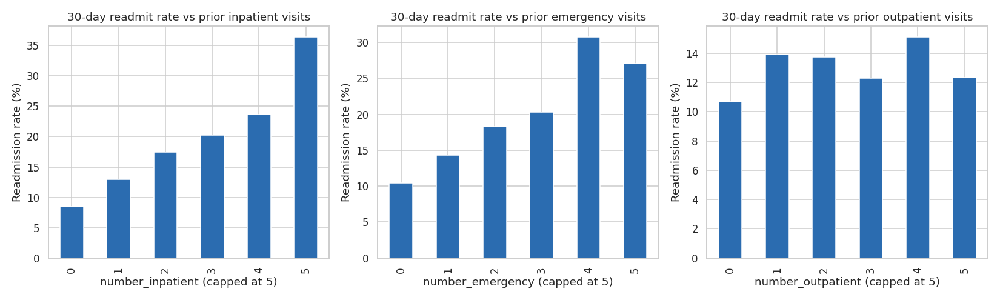

# 🏥 Healthcare Patient Readmission Prediction

Predicting 30-day hospital readmission risk for diabetic patients, using the
Diabetes 130-US Hospitals dataset (1999–2008, ~100K encounters across 130
hospitals). Built as an end-to-end, production-style data science project —
from business problem framing through EDA, cleaning, SQL analysis, ML
modeling, explainability, and a BI dashboard.

**Project status**: 🚧 In progress — built and documented one phase at a
time. See the [Progress](#-progress) section below.

## 📌 Why This Project

Hospital readmissions within 30 days are one of the most consequential
metrics in US healthcare operations:
- CMS penalizes hospitals with excess 30-day readmissions under the
  Hospital Readmissions Reduction Program (HRRP) — up to 3% of total
  Medicare reimbursement.
- A single readmission can cost $10,000–$15,000+.
- Diabetic patients are disproportionately at risk, since diabetes
  complicates recovery from nearly every other condition.

**Goal**: identify, at the moment of discharge, which diabetic patients are
most likely to be readmitted within 30 days — so hospital care teams can
target limited follow-up resources at the patients who need them most.

Full business/ML framing: [`docs/phase1_problem_statement.md`](docs/phase1_problem_statement.md)

## 📊 Dataset

**Diabetes 130-US Hospitals Dataset** — 101,766 encounters, 71,518 unique
patients, 50 features, from 130 US hospitals (1999–2008).
Source: [UCI Machine Learning Repository](https://archive.ics.uci.edu/dataset/296/diabetes+130-us+hospitals+for+years+1999-2008).
Original research: Strack et al., *"Impact of HbA1c Measurement on Hospital
Readmission Rates,"* BioMed Research International, 2014.

Full feature-by-feature breakdown: [`docs/phase2_data_understanding.md`](docs/phase2_data_understanding.md)

## 🗂️ Project Structure

```
healthcare-readmission-prediction/
├── data/
│   ├── raw/                     # Original dataset (diabetic_data.csv, IDs_mapping.csv)
│   └── processed/                # Cleaned, analytics-ready dataset (Phase 4 output)
├── docs/                        # Phase-by-phase write-ups (business + technical reasoning)
│   ├── phase1_problem_statement.md
│   ├── phase2_data_understanding.md
│   ├── phase3_eda.md
│   └── phase4_data_cleaning.md
├── src/
│   ├── eda.py                   # Modular, reusable EDA functions (Phase 3)
│   └── data_cleaning.py          # Cleaning + feature engineering pipeline (Phase 4)
├── sql/                         # Business-question SQL queries (Phase 5, upcoming)
├── notebooks/                   # Exploratory notebooks (as needed)
├── outputs/
│   ├── figures/                 # Generated EDA charts
│   ├── eda_summary.txt          # Console output log from src/eda.py
│   └── cleaning_summary.txt      # Console output log from src/data_cleaning.py
├── requirements.txt
├── .gitignore
├── LICENSE
└── README.md
```

## ✅ Progress

| Phase | Status | Write-up |
|---|---|---|
| 1. Problem Statement | ✅ Done | [docs/phase1_problem_statement.md](docs/phase1_problem_statement.md) |
| 2. Data Understanding | ✅ Done | [docs/phase2_data_understanding.md](docs/phase2_data_understanding.md) |
| 3. Exploratory Data Analysis | ✅ Done | [docs/phase3_eda.md](docs/phase3_eda.md) |
| 4. Data Cleaning & Feature Engineering | ✅ Done | [docs/phase4_data_cleaning.md](docs/phase4_data_cleaning.md) |
| 5. SQL Business Analysis | ⏳ Upcoming | — |
| 6. Machine Learning (LogReg, DT, RF, XGBoost) | ⏳ Upcoming | — |
| 7. Model Explainability (SHAP) | ⏳ Upcoming | — |
| 8. Power BI Dashboard | ⏳ Upcoming | — |
| 9. Final polished documentation | ⏳ Upcoming | — |

## 🔑 Key EDA Findings So Far

- **Class imbalance is real**: only **11.16%** of encounters are 30-day
  readmissions — accuracy is a misleading metric here; ROC-AUC and recall
  matter far more.
- **Prior healthcare utilization is the strongest signal found so far**:
  patients with 5+ prior inpatient visits have a **~36%** readmission rate,
  vs. **~8.5%** for first-time patients — a near-linear relationship.
- **A data leakage source was identified and quantified**: 2.38% of
  encounters are expired/hospice discharges, which structurally cannot be
  "readmitted" and artificially suppress the target rate in that group
  (1.77% vs. the ~11% baseline). These are removed before modeling.
- **Whether an A1C test was ordered matters more than the result**: tested
  patients (any result) show lower readmission rates (9.7–10.1%) than
  untested patients (11.4%) — replicating a finding from the original 2014
  research behind this dataset.

Full findings with charts: [`docs/phase3_eda.md`](docs/phase3_eda.md)



## 🧹 Data Cleaning Summary

Raw data (101,766 rows × 50 columns) was cleaned into an analytics-ready
table (99,320 rows × 40 columns, **0 missing values**): leakage rows removed,
13 near-zero-variance medication columns dropped, high-cardinality
categoricals grouped, ICD-9 diagnosis codes mapped to 9 clinical categories,
and utilization/medication features engineered. Scaling, one-hot encoding,
and the train/test split are deliberately deferred to a Phase 6 pipeline to
avoid data leakage. Full write-up: [`docs/phase4_data_cleaning.md`](docs/phase4_data_cleaning.md)

## ⚙️ Installation & Usage

```bash
# Clone the repo
git clone https://github.com/<your-username>/healthcare-readmission-prediction.git
cd healthcare-readmission-prediction

# Create a virtual environment (recommended)
python -m venv venv
source venv/bin/activate      # Windows: venv\Scripts\activate

# Install dependencies
pip install -r requirements.txt

# Reproduce the EDA (Phase 3)
python src/eda.py

# Reproduce data cleaning + feature engineering (Phase 4)
python src/data_cleaning.py
```

`src/eda.py` regenerates every figure in `outputs/figures/` and prints the
full statistical summary (missing values, leakage check, outlier report,
correlation matrix) to the console. `src/data_cleaning.py` reads
`data/raw/diabetic_data.csv` and writes the cleaned, analytics-ready table to
`data/processed/cleaned_diabetic_data.csv`.

## 🎯 Business Impact (so far)

Even before any ML model is trained, the EDA alone surfaces an actionable
insight: **a hospital could start flagging patients with 3+ prior inpatient
visits in the past year for proactive discharge planning today**, without
waiting for a model. This becomes the benchmark that the ML models built in
Phase 6 will need to beat in order to justify their added complexity — a
question this project answers explicitly rather than assuming.

## 📄 License

Code in this repository is released under the [MIT License](LICENSE). The
dataset itself is subject to the UCI Machine Learning Repository's terms —
see the [dataset source](https://archive.ics.uci.edu/dataset/296/diabetes+130-us+hospitals+for+years+1999-2008)
for details. This project is built for educational/portfolio purposes.
