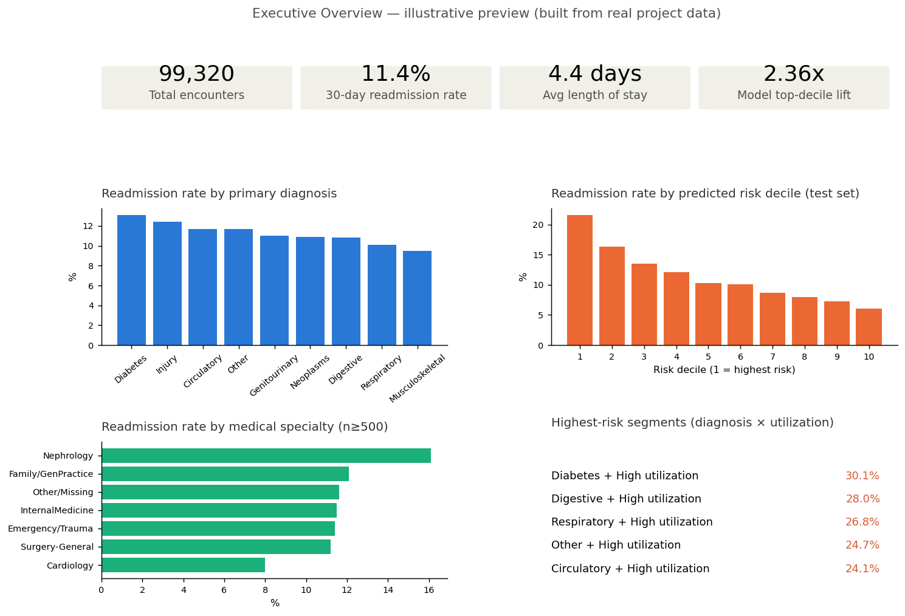

# 🏥 Healthcare Patient Readmission Prediction

**Predicting which diabetic patients are likely to be readmitted within 30
days — so a hospital's care team knows who to call first.**

An end-to-end, production-style data science project built on the Diabetes
130-US Hospitals dataset (1999–2008, ~100K encounters, 130 hospitals):
business framing → EDA → SQL analysis → machine learning → explainability →
BI dashboard design. Every number in this README is computed from the real
dataset — nothing here is illustrative unless explicitly labeled as such.

## 📈 Results at a glance

| | |
|---|---|
| **Best model** | XGBoost — ROC-AUC 0.667, top-decile lift **2.36x** |
| **Beats a SQL-only rule by** | ~24% (2.36x vs. 1.9x lift) — a quantified case for the ML model |
| **Top driver** | `number_inpatient` (prior hospitalizations) — confirmed independently by EDA, SQL, *and* SHAP |
| **Highest-risk segment** | Diabetes-primary diagnosis + 6+ prior visits → **30% readmission rate** |
| **Fairness** | `race`/`payer_code` excluded from the model at a cost of just **+0.0015 AUC** if included |


*Static preview built from real project numbers — see [Dashboard](#-dashboard-design-phase-8) below for the full interactive design.*

## 📌 The Business Problem

Hospital readmissions within 30 days are one of the most consequential
metrics in US healthcare operations:
- CMS penalizes hospitals with excess 30-day readmissions under the
  Hospital Readmissions Reduction Program (HRRP) — up to 3% of total
  Medicare reimbursement.
- A single readmission can cost $10,000–$15,000+.
- Diabetes complicates recovery from nearly every other condition, making
  diabetic patients disproportionately likely to bounce back.

**Goal**: flag high-risk diabetic patients at the moment of discharge, so
care teams can target limited follow-up resources where they matter most.
Full framing: [`docs/phase1_problem_statement.md`](docs/phase1_problem_statement.md)

## 📊 The Dataset

101,766 encounters, 71,518 unique patients, 50 features, 130 US hospitals.
Source: [UCI Machine Learning Repository](https://archive.ics.uci.edu/dataset/296/diabetes+130-us+hospitals+for+years+1999-2008).
Original research: Strack et al., *"Impact of HbA1c Measurement on Hospital
Readmission Rates,"* BioMed Research International, 2014.
Full feature breakdown: [`docs/phase2_data_understanding.md`](docs/phase2_data_understanding.md)

## 🔑 Key Findings

- **Class imbalance is real** (11.4% positive rate) — accuracy is a
  misleading headline metric here; every model in this project is judged
  on ROC-AUC and top-decile lift instead.
- **Prior utilization dominates** — patients with 5+ prior inpatient visits
  have a ~36% readmission rate vs. ~8.5% for first-timers. Confirmed three
  independent ways: EDA correlation (Phase 3), SQL stratification (Phase 5),
  and the trained model's own SHAP attribution (Phase 7).
- **A leakage source was found and removed**: 2.38% of encounters are
  expired/hospice discharges that structurally cannot be "readmitted."
- **A real pipeline bug was caught and fixed mid-project** — a
  sparse-matrix/missing-value interaction was silently corrupting ~62% of
  XGBoost's training input. Full story: [`docs/phase6_machine_learning.md`](docs/phase6_machine_learning.md#61-a-bug-caught-and-fixed-mid-phase-documented-not-hidden).
- **Length-of-stay reduction needs a guardrail** — the shortest stays show
  the *lowest* readmission risk, not the highest, so a naive cost-cutting
  push could backfire.

## 🤖 Machine Learning

Four models compared with a **patient-level** train/test split (verified
zero patient overlap) and leakage-safe preprocessing:

| Model | Accuracy | Precision | Recall | F1 | ROC-AUC | Top-decile lift |
|---|---|---|---|---|---|---|
| Logistic Regression | 0.666 | 0.179 | 0.549 | 0.270 | 0.660 | 2.25x |
| Decision Tree | 0.665 | 0.172 | 0.519 | 0.258 | 0.643 | 2.24x |
| Random Forest | 0.673 | 0.181 | 0.540 | 0.271 | 0.664 | 2.29x |
| **XGBoost** | 0.661 | 0.180 | 0.565 | 0.273 | **0.667** | **2.36x** |


Full model comparison, calibration caveats, and the story of the bug that
was caught and fixed along the way: [`docs/phase6_machine_learning.md`](docs/phase6_machine_learning.md)

## 🔍 Model Explainability (SHAP)


`number_inpatient` is the clear #1 driver. Local explanations on the
model's true highest- and lowest-risk test patients are clean,
one-sentence-explainable stories (e.g. *"flagged primarily because of 11
prior inpatient visits"*) — a direct result of catching and fixing the
Phase 6 bug. A second, independent pitfall (rare one-hot categories
inflating raw SHAP rankings) was also caught and corrected using the same
volume-threshold discipline as the Phase 5 SQL queries.
Full write-up: [`docs/phase7_model_explainability.md`](docs/phase7_model_explainability.md)

## 🗃️ SQL Analysis

8 business-question queries (aggregation, `CASE WHEN`, `HAVING`, `JOIN`s,
CTEs, window functions) against a real SQLite database built from the
cleaned data. Headline finding: a hand-weighted, ML-free risk rule already
achieves a **1.9x lift** over random selection — the bar every ML model in
Phase 6 had to clear. Full write-up: [`docs/phase5_sql_analysis.md`](docs/phase5_sql_analysis.md)

## 📊 Dashboard Design (Phase 8)

A star-schema data export (`powerbi/`) plus a complete 4-page Power BI
design spec (Executive Overview, Risk Segmentation & Prioritization,
Clinical & Operational Drivers, Model Performance & Trust) with DAX
measures, filters, and business recommendations.

Two real constraints shaped this design, handled explicitly rather than
papered over:
- **No date or hospital field in the data** — ruled out a time-trend page
  and a hospital-comparison page. The design pivots entirely around
  dimensions the data actually supports.
- **Train/test discipline carried into the BI layer** — every row in
  `fact_encounters.csv` is tagged `data_split = "train"` or `"test"`, and
  only test-split (genuinely out-of-sample) rows carry a risk score. An
  early version scored the full dataset and showed artificially inflated
  confidence on memorized training patients — caught and fixed before
  shipping.

Full design spec: [`docs/phase8_dashboard_design.md`](docs/phase8_dashboard_design.md)

### 📸 Screenshots

| | |
|---|---|
| ✅ **Executive overview preview** (static, real data) | Shown at the top of this README |
| ⏳ **Full interactive Power BI dashboard** | Not yet built — Power BI Desktop is a proprietary tool outside this environment. `docs/phase8_dashboard_design.md` is detailed enough to build all 4 pages directly from the `powerbi/` data export. Screenshots will be added here once built. |

## 🗂️ Project Structure

```
healthcare-readmission-prediction/
├── data/
│   ├── raw/                      # Original dataset + parsed lookup tables
│   └── processed/                 # Cleaned data (Phase 4) + SQLite DB (Phase 5)
├── docs/                         # Phase-by-phase write-ups (9 documents)
├── src/
│   ├── eda.py                    # Phase 3
│   ├── data_cleaning.py           # Phase 4
│   ├── run_sql_analysis.py        # Phase 5
│   ├── train_models.py            # Phase 6
│   ├── explainability.py          # Phase 7
│   └── build_dashboard_data.py    # Phase 8
├── sql/                          # 8 business-question SQL queries
├── powerbi/                      # Star-schema data export for the dashboard
├── models/                       # Saved best model pipeline (gitignored - reproducible)
├── outputs/                      # Figures, logs, result tables from every phase
├── requirements.txt / .gitignore / LICENSE
```

## ✅ Progress

| Phase | Status | Write-up |
|---|---|---|
| 1. Problem Statement | ✅ | [docs/phase1_problem_statement.md](docs/phase1_problem_statement.md) |
| 2. Data Understanding | ✅ | [docs/phase2_data_understanding.md](docs/phase2_data_understanding.md) |
| 3. Exploratory Data Analysis | ✅ | [docs/phase3_eda.md](docs/phase3_eda.md) |
| 4. Data Cleaning & Feature Engineering | ✅ | [docs/phase4_data_cleaning.md](docs/phase4_data_cleaning.md) |
| 5. SQL Business Analysis | ✅ | [docs/phase5_sql_analysis.md](docs/phase5_sql_analysis.md) |
| 6. Machine Learning | ✅ | [docs/phase6_machine_learning.md](docs/phase6_machine_learning.md) |
| 7. Model Explainability (SHAP) | ✅ | [docs/phase7_model_explainability.md](docs/phase7_model_explainability.md) |
| 8. Power BI Dashboard Design | ✅ | [docs/phase8_dashboard_design.md](docs/phase8_dashboard_design.md) |
| 9. Final Documentation | ✅ | [docs/phase9_final_documentation.md](docs/phase9_final_documentation.md) |

## ⚙️ Installation & Usage

```bash
git clone https://github.com/<your-username>/healthcare-readmission-prediction.git
cd healthcare-readmission-prediction

python -m venv venv
source venv/bin/activate      # Windows: venv\Scripts\activate
pip install -r requirements.txt

# Run the full pipeline, in order
python src/eda.py                    # Phase 3: EDA figures + stats
python src/data_cleaning.py          # Phase 4: cleaned dataset
python src/run_sql_analysis.py       # Phase 5: SQLite DB + query results
python src/train_models.py           # Phase 6: train + compare 4 models
python src/explainability.py         # Phase 7: SHAP global + local explanations
python src/build_dashboard_data.py   # Phase 8: Power BI data exports
```

## 🎯 Business Impact

Before any model was trained, SQL analysis alone surfaced an actionable
finding: **diabetes-primary diagnosis + 6+ prior visits = a 30% readmission
rate**, a well-defined ~700-patient population worth a dedicated
intervention program. The trained XGBoost model then improved on the best
manual rule by ~24% in top-decile lift — a concrete, quantified answer to
"is the added model complexity worth it?" rather than an assumption.

**An illustrative, clearly-labeled estimate**: if a hospital could act on
the top 10% of discharges by predicted risk (per Phase 6/7), that group
captures roughly 24% of all 30-day readmissions in the historical data. At
a commonly-cited cost of ~$12,500 per avoided readmission (industry
estimate, not from this dataset), even a modest 15–20% reduction in
readmissions within that flagged group would represent meaningful avoided
cost at hospital scale — the exact multiplier depends on local intervention
effectiveness, which this project doesn't measure directly and any real
deployment would need to validate with a pilot.

## 📄 License

Code in this repository is released under the [MIT License](LICENSE). The
dataset is subject to the UCI Machine Learning Repository's terms — see the
[dataset source](https://archive.ics.uci.edu/dataset/296/diabetes+130-us+hospitals+for+years+1999-2008)
for details. Built for educational/portfolio purposes.
