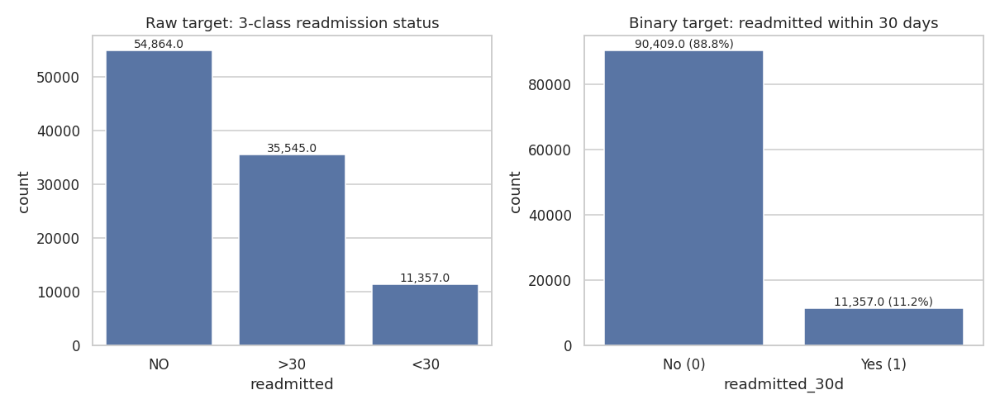
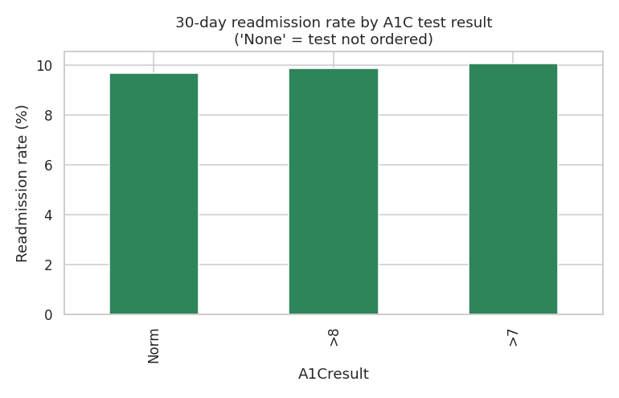
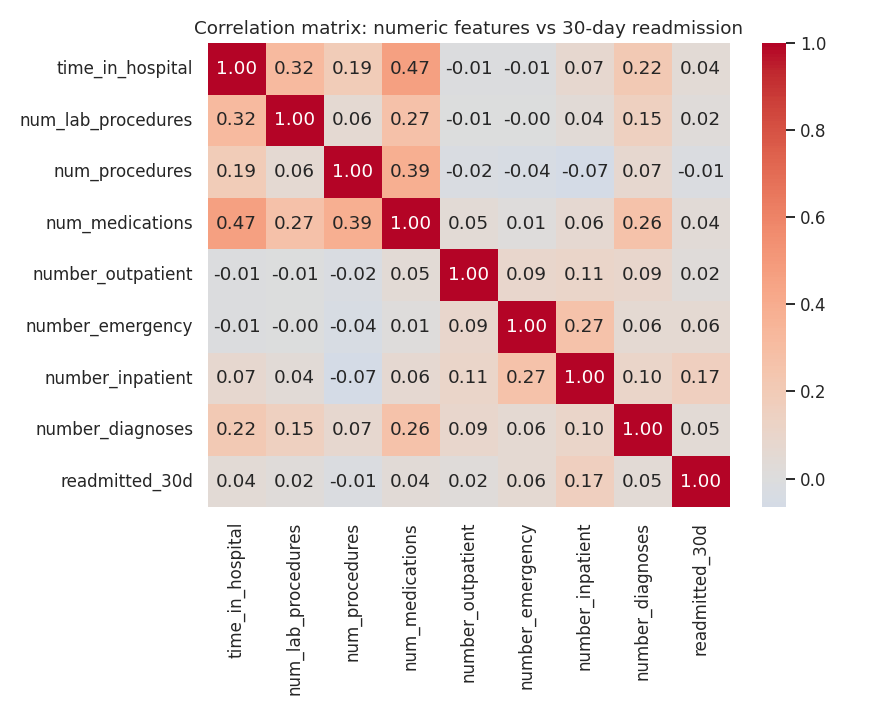
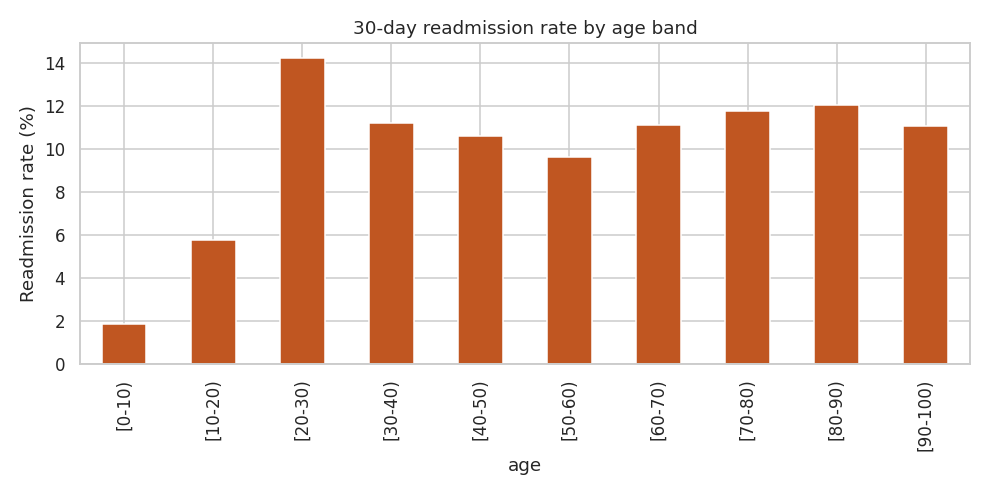
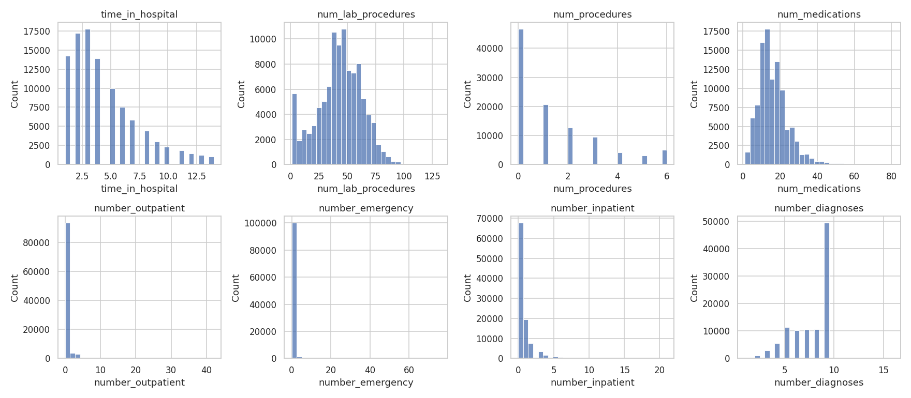
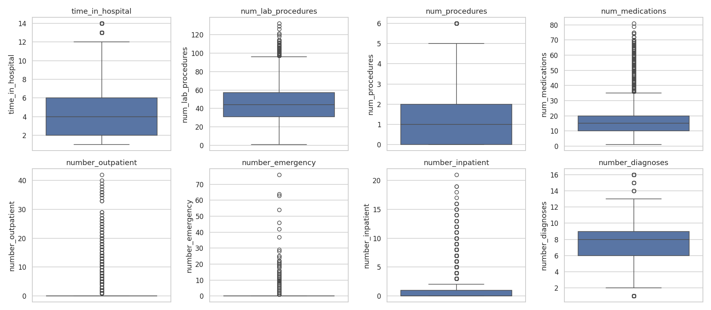

# Phase 3: Exploratory Data Analysis

All findings below are computed from the real dataset (101,766 encounters,
71,518 unique patients) using [`src/eda.py`](../src/eda.py). Run
`python src/eda.py` from the project root to reproduce every number and
figure in this document.

## 3.1 Missing Values

| Feature | Missing % | Interpretation |
|---|---|---|
| `weight` | 96.86% | Unusable — dropped |
| `max_glu_serum` | 94.75% | Glucose test rarely ordered |
| `A1Cresult` | 83.28% | Rarely ordered — but informative as a feature (see 3.4) |
| `medical_specialty` | 49.08% | Half of encounters lack recorded specialty |
| `payer_code` | 39.56% | Insurance type often unrecorded |
| `race` | 2.23% | Minor |
| `diag_1/2/3` | 0.02–1.40% | Negligible |

**Domain trap**: missing values in this dataset are encoded as the literal
string `"?"`, not blank/`NaN`. Running `.isnull().sum()` on the raw CSV
reports **zero** missing values unless `"?"` is replaced first — a classic
silent-failure trap.

The missingness itself has a pattern, not randomness: `max_glu_serum` and
`A1Cresult` are missing because the test wasn't ordered — a clinically
informative fact, not noise. Handled in Phase 4 by encoding "not tested" as
its own category rather than imputing.

## 3.2 Target Distribution

- `NO`: 54,864 (53.9%) · `>30`: 35,545 (34.9%) · `<30`: 11,357 (11.2%)
- Binary target positive rate: **11.16%**

Confirms the class imbalance flagged in Phase 1 — a "never readmitted"
model would score ~88.8% accuracy while being useless, which is why ROC-AUC
and recall/precision are the metrics that matter here, not accuracy.

## 3.3 Leakage Check — Expired / Hospice Discharges

Quantified: **2,423 encounters (2.38%)** have `discharge_disposition_id`
codes corresponding to expired or hospice discharge. Their measured 30-day
readmission rate is **1.77%** — artificially suppressed, confirming the
contamination flagged in Phase 2. **Action**: these rows are removed before
modeling in Phase 4.

## 3.4 A1C Testing — Validating a Real Clinical Finding

| A1C status | Readmit rate | n |
|---|---|---|
| Not Tested | **11.42%** | 84,748 |
| >7 (elevated) | 10.05% | 3,812 |
| >8 (high) | 9.87% | 8,216 |
| Normal | 9.66% | 4,990 |

Patients who received an A1C test — regardless of result — had a *lower*
readmission rate than patients never tested. This isn't necessarily causal,
but suggests that whether a diagnostic test was ordered is itself a proxy
for how proactively the care team managed the patient's diabetes,
replicating a known finding from the original research (Strack et al., 2014)
behind this dataset.

## 3.5 Prior Utilization — The Strongest Signal

| Prior inpatient visits | Readmit rate |
|---|---|
| 0 | ~8.5% |
| 1 | ~13% |
| 2 | ~17% |
| 3 | ~20% |
| 4 | ~24% |
| 5+ | **~36%** |

A near-monotonic relationship — patients with 5+ prior hospitalizations are
over 4x more likely to be readmitted within 30 days than first-time
patients. `number_inpatient` has the strongest correlation with the target
(0.165) of any numeric feature — more than double the next strongest
(`number_emergency`, 0.061). See full correlation matrix:

**Business implication**: a hospital could start flagging patients with 3+
prior inpatient visits for proactive discharge planning today, without any
ML model. This becomes a benchmark in Phase 6 — any trained model needs to
beat this simple rule to justify its added complexity.

## 3.6 Age — A Weaker, Non-Monotonic Signal

Readmission rate ranges ~9.7%–14.2% across adult age bands — much flatter
than utilization-based signals. Young children ([0-10)) sit at 1.86%
(n=161). The elderly (70–90) plateau around 11–12%, not dramatically
elevated. Age alone is a weak predictor relative to clinical intuition.

## 3.7 Outliers

`number_outpatient` (16.45% IQR-flagged), `number_emergency` (11.19%),
`number_inpatient` (6.93%), and `num_procedures` (4.87%) show the most
statistical outliers. See distributions and boxplots:

**Framing for Phase 4**: unlike retail/finance data, most of these
"outliers" are legitimate high-acuity patients (e.g., someone with 15 prior
emergency visits), not data errors — exactly the patients this project
exists to identify. They will be capped only where needed for specific
model stability (e.g., linear models), never deleted.

## 3.8 Diagnosis Code Cardinality

`diag_1`, `diag_2`, `diag_3` have 716, 748, and 789 unique ICD-9 codes
respectively — confirming the need for clinical grouping in Phase 4 rather
than direct one-hot encoding.

## 3.9 Business Insight Summary

> Three findings anchor everything downstream: **(1)** the 11.2% positive
> rate means every model must be evaluated on ranking/recall, never accuracy
> alone; **(2)** prior utilization is a strikingly strong, near-linear risk
> signal — strong enough to serve as a benchmark, not just a feature;
> **(3)** `A1Cresult` and `max_glu_serum` are more valuable as "was this
> test ordered?" signals than as lab results, meaning feature engineering
> will matter more than model choice for this dataset.
