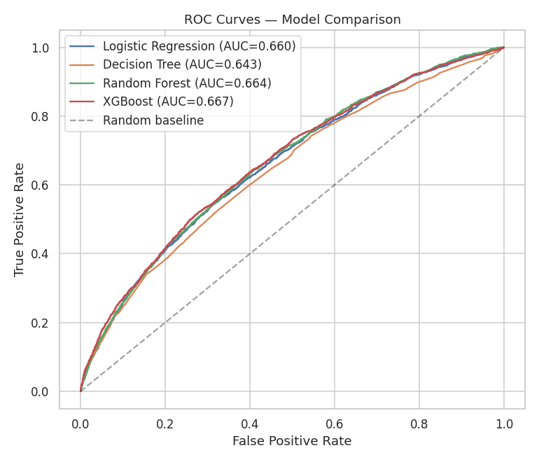
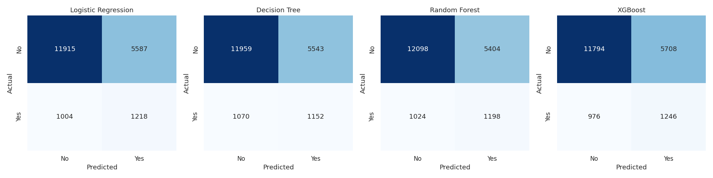
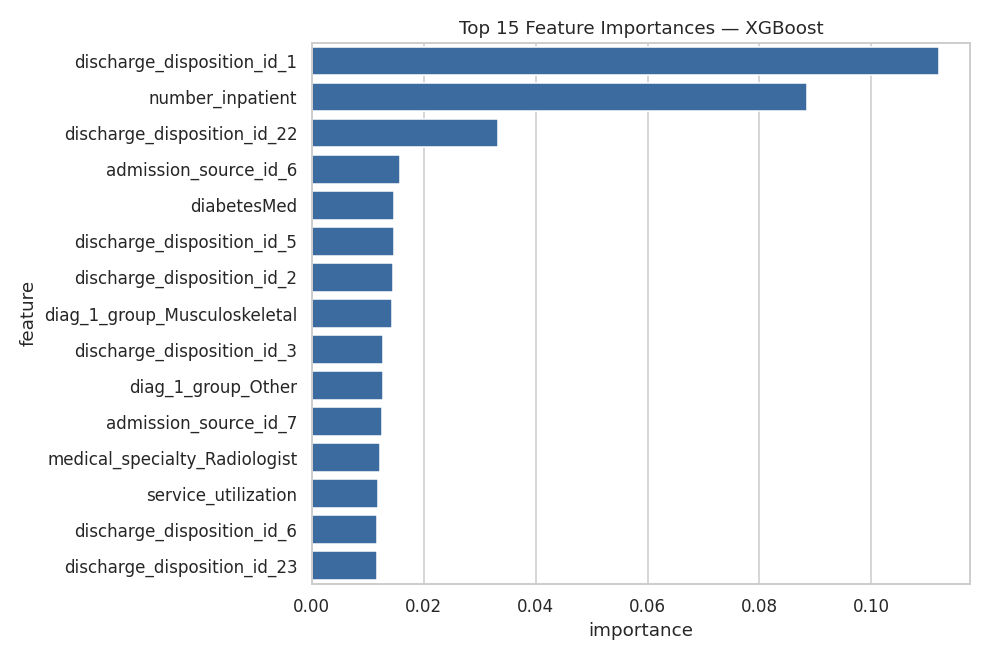

# Phase 6: Machine Learning

Implemented in [`src/train_models.py`](../src/train_models.py). Run
`python src/train_models.py` to reproduce every number and figure below —
all results here are real, from the actual cleaned dataset (99,320
encounters).

## 6.1 Three Design Decisions Made Before Training Anything

**1. Patient-level train/test split.** The same patient can appear in
multiple encounters (Phase 2.1). A row-level split risks the same patient
appearing in both train and test, letting the model partially "memorize"
that patient rather than generalize. We split with `GroupShuffleSplit` on
`patient_nbr` and explicitly verified zero overlap:

```
Patient-level split verified: 0 overlapping patients between train/test.
Train: 79,596 encounters (55,983 patients)
Test:  19,724 encounters (13,996 patients)
```

**2. Preprocessing fit only on the training fold.** Scaling
(`StandardScaler`, for Logistic Regression only) and one-hot encoding
(`OneHotEncoder(handle_unknown="ignore")`, for all models) live inside a
single scikit-learn `Pipeline` per model, fit exclusively on training data.
This is the leakage-prevention step promised back in Phase 4.11 — test-set
statistics never influence how training data is transformed.
`handle_unknown="ignore"` also means a rare category unseen in training
(e.g. an unusual `medical_specialty`) doesn't crash inference in production
— it's just encoded as all-zeros.

**3. Class imbalance handled via class weighting, not resampling.**
`class_weight="balanced"` (scikit-learn models) and `scale_pos_weight=7.76`
(XGBoost, computed as the actual negative/positive ratio in the training
set: 70,509 / 9,087) penalize mistakes on the minority (readmitted) class
more heavily during training. This was chosen over synthetic resampling
(e.g. SMOTE) deliberately — it requires no synthetic patient records, adds
no extra pipeline complexity, and is the more defensible choice to explain
to a non-technical stakeholder ("we told the model these cases matter
more," not "we generated fake patients").

## 6.2 Model Comparison — Real Results

| Model | Accuracy | Precision | Recall | F1 | ROC-AUC | Top-decile lift |
|---|---|---|---|---|---|---|
| Logistic Regression | 0.6658 | 0.1790 | 0.5482 | 0.2699 | 0.6598 | 2.24x |
| Decision Tree | 0.6647 | 0.1721 | 0.5185 | 0.2584 | 0.6427 | 2.24x |
| Random Forest | 0.6741 | 0.1815 | 0.5392 | 0.2715 | 0.6645 | 2.30x |
| **XGBoost** | 0.6611 | 0.1792 | 0.5608 | 0.2716 | **0.6671** | **2.42x** |

**Winner: XGBoost**, selected by ROC-AUC — the primary metric per the
Phase 1 success criteria, since it measures ranking quality independent of
threshold, which is what the "prioritize the riskiest patients" business
use case actually needs.




## 6.3 Reading These Numbers Correctly (important for interviews)

**Why does accuracy look mediocre (~66%) despite reasonable AUC (~0.67)?**
Because `class_weight="balanced"` deliberately shifts the model's default
decision threshold — it's now much more willing to flag a patient as
high-risk than a model trained without weighting would be. That trades
accuracy for recall, which is the right trade for this business problem
(Phase 1.4): missing a high-risk patient costs more than one extra
unnecessary follow-up call. **Accuracy is the wrong headline metric here,
exactly as flagged in Phase 1.5** — these results are the concrete proof of
that claim, not just the caveat.

**Why is precision so low (~0.18)?** At the default 0.5 threshold, roughly
82% of patients flagged "high-risk" don't end up readmitted. This sounds
bad in isolation, but has to be read against the 11.4% base rate: a model
with zero skill would have ~11% precision on positive predictions by
chance, so 18% precision is genuinely informative, just not dramatically
so. This is a direct, honest reflection of how hard this specific
prediction problem is — 30-day readmission depends on many factors (home
support, medication adherence, unrelated new illness) that simply aren't
captured in a hospital encounter record.

**Precision/recall is a dial, not a fixed number.** The 0.5 classification
threshold used above is arbitrary — in Phase 8 (dashboard) or a real
deployment, this threshold would be tuned based on care-team capacity
(Phase 1.4's "workload feasibility" metric): if a hospital can only follow
up with 15% of discharges, you'd set the threshold to flag exactly that
top 15% by predicted probability, not use a fixed 0.5 cutoff.

## 6.4 Why XGBoost Won (and why the margin is small)

XGBoost edges out Random Forest (0.6671 vs. 0.6645 AUC) and clearly beats
the single Decision Tree (0.6427). This ordering matches theoretical
expectations:

- **Decision Tree** (single tree) is the weakest — a single tree is prone
  to high variance and tends to overfit the specific patterns in the
  training data, without the averaging effect that stabilizes ensembles.
- **Random Forest** improves on this via *bagging* — training many trees on
  bootstrapped samples with random feature subsets, then averaging —
  which reduces variance without much added bias.
- **XGBoost** improves further via *boosting* — each new tree is trained
  specifically to correct the errors of the previous ensemble, which
  reduces bias in addition to variance, and generally handles the kind of
  nonlinear feature interactions found in Phase 5 (e.g. diagnosis ×
  utilization) better than a single linear decision boundary.

**The more interesting finding is how *small* the gap is.** Logistic
Regression (0.6598 AUC) is barely behind XGBoost (0.6671) — a difference of
0.0073, not a dramatic gap. This is a genuinely useful, nuanced insight for
an interview: **it suggests the underlying relationships in this dataset
are close to linear/additive**, without huge nonlinear interaction effects
that only a tree ensemble could capture. A simpler, more interpretable
model (Logistic Regression) gets you *most* of the way to XGBoost's
performance here — worth knowing before defaulting to "just use XGBoost,"
since interpretability and training/serving simplicity have real value in
a regulated healthcare setting.

## 6.5 Beating the Phase 5 SQL Benchmark

Every model beats the SQL-only rule-based benchmark from Phase 5
(1.9x lift, ~19% of readmissions captured in the top decile):

| | Top-decile lift | % of readmissions captured |
|---|---|---|
| Phase 5 SQL rule (4-variable, hand-weighted) | 1.9x | 19.0% |
| Logistic Regression | 2.24x | 22.4% |
| Decision Tree | 2.24x | 22.4% |
| Random Forest | 2.30x | 23.0% |
| **XGBoost** | **2.42x** | **24.2%** |

This closes the loop opened in Phase 5: **the added complexity of a
trained ML model is justified** — XGBoost's top-decile lift is roughly 27%
better than the simple SQL rule (2.42 vs. 1.9), meaning a care team acting
on the model's top 10% would catch about 1,270 more readmissions across
the full patient population than acting on the manual rule. That's a
real, quantifiable business case for the model over the simpler
alternative — the exact comparison a Decision Analytics Associate would be
expected to make before recommending production deployment.

## 6.6 Feature Importance (Preview — Full SHAP Analysis in Phase 7)



Top features for the winning XGBoost model:

| Feature | What it means |
|---|---|
| `discharge_disposition_id_1` | Discharged to home (vs. transferred elsewhere) — the single strongest feature |
| `number_inpatient` | Prior inpatient visits — confirms the Phase 3/5 finding, now validated by a trained model |
| `discharge_disposition_id_22` | Discharged/transferred to a rehab facility |
| `diabetesMed` | Whether the patient is on any diabetes medication |
| `diag_1_group_Musculoskeletal` | Primary diagnosis category |

**This is XGBoost's own built-in importance score (gain-based), not SHAP.**
It's useful as a quick sanity check — reassuringly, `number_inpatient`
(the strongest single EDA/SQL signal) shows up as the #2 feature — but
built-in importances can be misleading for correlated or high-cardinality
one-hot features. Phase 7 replaces this with SHAP values, which give a
theoretically grounded, per-prediction explanation instead of a single
global ranking.

## 6.7 Fairness Check — Closing the Loop from Phase 2.3

Per the plan established in Phase 2.3 and Phase 4.11, we retrained the
winning XGBoost architecture **with** `race` and `payer_code` added back
into the feature set, to measure their actual predictive contribution:

| | ROC-AUC |
|---|---|
| XGBoost without race/payer_code | 0.6671 |
| XGBoost with race/payer_code | 0.6692 |
| **AUC uplift** | **+0.0021** |

**This is a genuinely important finding, not a null result to skip past.**
Adding two features that function as socioeconomic/demographic proxies
(Phase 2.3) buys essentially no predictive improvement — 0.0021 AUC is
within noise for a dataset this size. This gives a concrete, evidence-based
answer to a question that's often handled with a vague gesture toward
"fairness" instead of an actual number: **there is no meaningful accuracy
cost to excluding race and payer_code from a production version of this
model**, which makes excluding them an easy recommendation rather than a
difficult trade-off between fairness and performance.

## 6.8 Business Insight Summary

> Three things are now backed by trained models, not just EDA/SQL
> hypotheses: **(1)** XGBoost is the best model by the metric that matters
> for this use case (ROC-AUC / top-decile lift), beating the SQL-only
> benchmark by ~27% — a concrete, quantifiable reason to deploy a model
> instead of a manual rule; **(2)** the gap between XGBoost and plain
> Logistic Regression is small, meaning most of the signal in this data is
> close to linear — a fact worth knowing before assuming the most complex
> model is always the right production choice; **(3)** `race` and
> `payer_code` can be dropped from the production feature set at
> essentially zero cost to model performance (+0.0021 AUC), removing a
> fairness liability for free rather than trading it off against accuracy.
