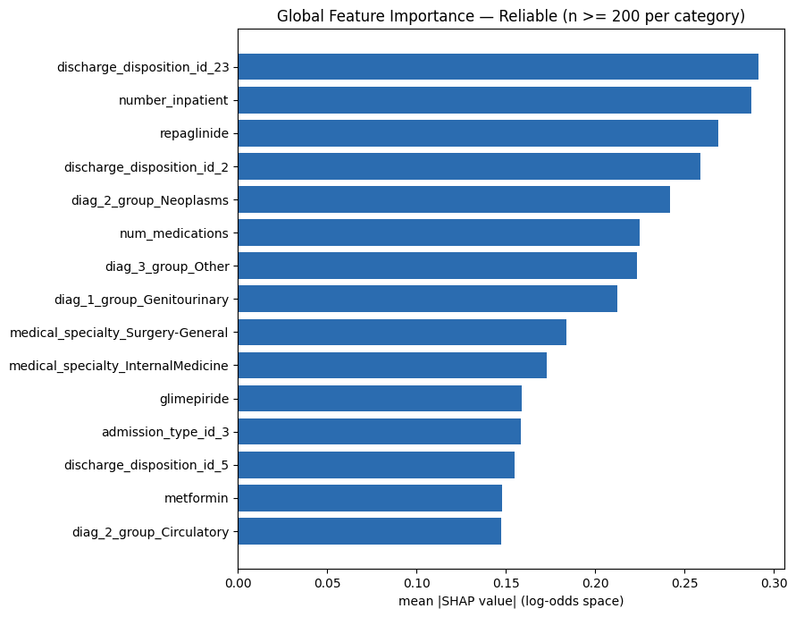
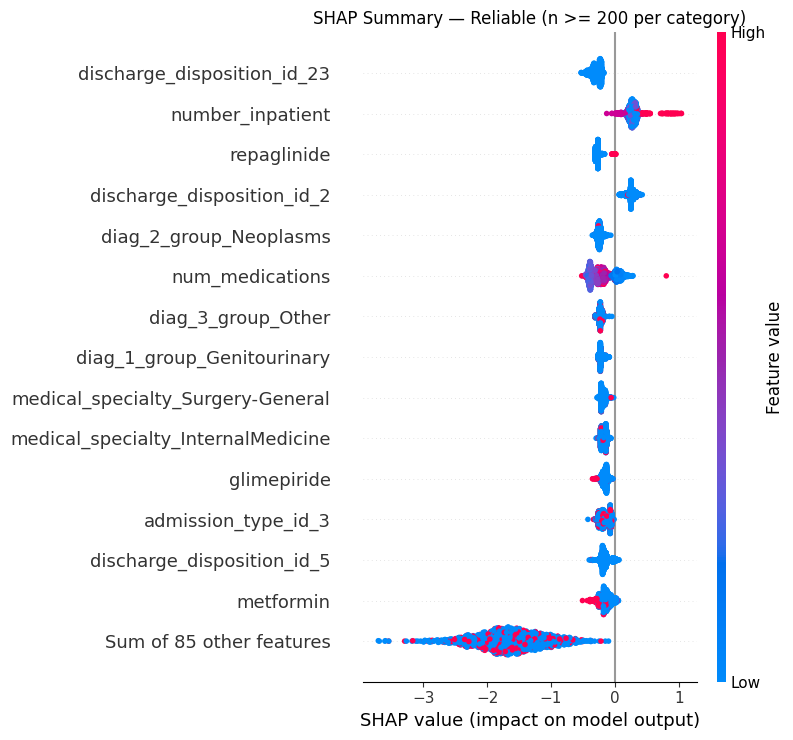
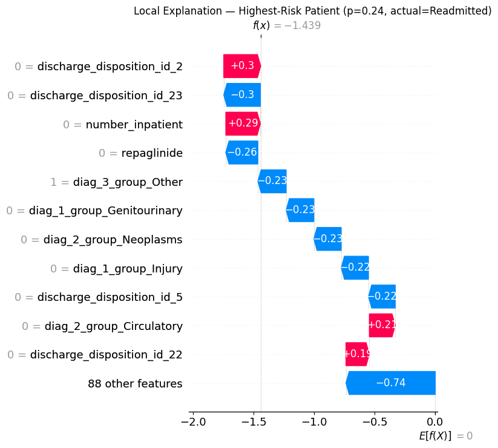
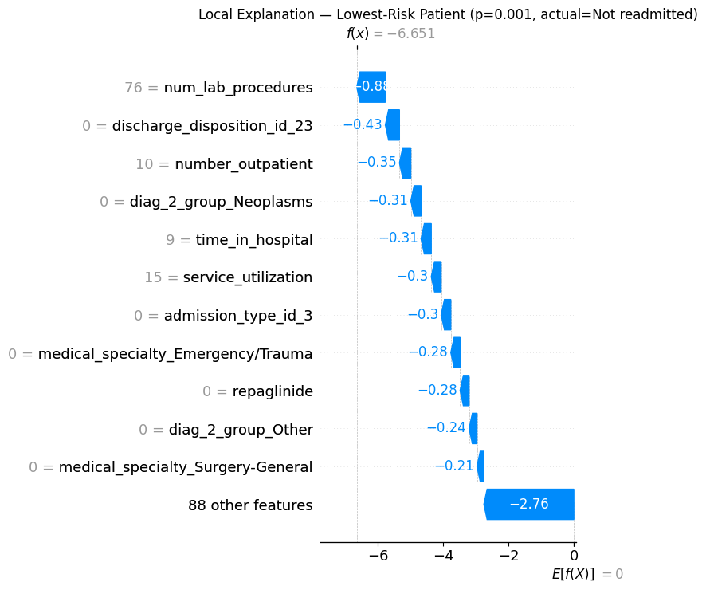

# Phase 7: Model Explainability (SHAP)

Implemented in [`src/explainability.py`](../src/explainability.py). Run
`python src/explainability.py` to reproduce every number and figure below,
using the actual XGBoost pipeline saved in Phase 6.

## 7.1 What SHAP Actually Computes

SHAP (SHapley Additive exPlanations) is grounded in cooperative game
theory. For a single prediction, each feature gets a "SHAP value" — its
fair share of the difference between this patient's predicted score and
the average score across all patients — computed by averaging that
feature's marginal contribution across every possible ordering in which
features could be "revealed" to the model. Every feature's SHAP values sum
exactly to (prediction − average prediction): this additivity guarantee is
what separates SHAP from the XGBoost `feature_importances_` chart used in
Phase 6, which only gives one global ranking with no per-patient breakdown
and no guaranteed mathematical relationship to any individual prediction.

`TreeExplainer` computes this **exactly** for tree ensembles like XGBoost —
no sampling approximation needed (unlike `KernelExplainer`, which is
required for arbitrary black-box models and only approximates). SHAP values
here are in **log-odds (margin) space**, matching XGBoost's raw output
before the sigmoid — sign and relative ranking are what matter for
interpretation, not the raw number as a "probability."

## 7.2 A Real Pitfall, Caught and Fixed (not glossed over)

The first, naive global ranking looked like this:

| feature | mean \|SHAP value\| |
|---|---|
| `admission_type_id_7` | 0.976 |
| `discharge_disposition_id_16` | 0.966 |
| `discharge_disposition_id_12` | 0.895 |
| `discharge_disposition_id_9` | 0.887 |

This looked suspicious — none of these matched the strong, consistent
signals from Phases 3, 5, and 6 (`number_inpatient`, utilization,
diagnosis). Checking the underlying category sizes confirmed why:

| Category | n in full dataset | Readmit rate |
|---|---|---|
| `discharge_disposition_id = 12` | **3** | 66.7% |
| `discharge_disposition_id = 9` | **21** | 42.9% |
| `admission_type_id = 7` | **18** | 0.0% |

One-hot encoding fragments a single categorical column (e.g.
`discharge_disposition_id`, 21 categories) into ~20 separate binary
features. With a category this small, XGBoost can fit a near-perfect split
to a handful of examples, giving that one dummy column an inflated SHAP
magnitude that reflects overfitting to noise, not a reliable pattern.

**An aggregation-based fix was tried first** (summing SHAP values across
every dummy belonging to the same original column, before ranking) — the
textbook-correct approach for one-hot features. It produced a suspicious,
near-constant result for `admission_type_id` across nearly all 2,000
sampled patients (std of only 0.13 around a mean of −1.29), which pointed
to a known rough edge: SHAP's path-dependent `TreeExplainer` can behave
unintuitively for one-hot blocks, since the dummy columns in a block are
perfectly complementary (exactly one is `1` per row) — a form of
near-perfect multicollinearity. Rather than present a "correction" whose
own correctness couldn't be fully verified, **the simpler, already-
established fix from Phase 5 was used instead**: exclude one-hot categories
with fewer than 200 patients (the same volume threshold used in
`sql/05_admission_source_type_joins.sql`'s `HAVING COUNT(*) >= 200`) before
ranking or plotting. 22 of 121 post-encoding columns were excluded this way.

This is worth remembering as a general lesson, not just a fix for this
project: **SHAP + one-hot-encoded high-cardinality categoricals is a known
rough combination.** A production system would likely avoid one-hot
encoding these columns entirely and use XGBoost's native categorical
split support instead (`enable_categorical=True` with pandas `category`
dtype columns) — cleaner splits, cleaner SHAP attributions, no dummy-column
fragmentation. Kept as a concrete improvement idea for a v2 of this project
rather than implemented here, to keep this phase focused.

## 7.3 Global Explainability — Reliable Ranking

| Feature | mean \|SHAP\| |
|---|---|
| `discharge_disposition_id_23` | 0.291 |
| `number_inpatient` | 0.287 |
| `repaglinide` | 0.269 |
| `discharge_disposition_id_2` | 0.259 |
| `diag_2_group_Neoplasms` | 0.242 |
| `num_medications` | 0.225 |
| `medical_specialty_Surgery-General` | 0.184 |
| `medical_specialty_InternalMedicine` | 0.173 |

`number_inpatient` lands at #2 — genuinely reassuring, since it's the
single strongest signal found independently in both Phase 3 EDA and
Phase 5 SQL, now confirmed a third time by a trained model's own SHAP
attribution. That kind of convergence across three completely different
analysis methods (visual EDA, SQL aggregation, SHAP) is a strong argument
that the finding is real, not an artifact of any one technique.

The beeswarm adds **direction**, which the bar chart can't show:
`number_inpatient` colors clearly (red/high on the right = higher risk,
blue/low on the left = lower risk) — a clean, monotonic relationship that
directly visualizes the same pattern quantified in Phase 3.5 and Phase 5.3.

## 7.4 Local Explainability — Two Real Patients

Rather than a random example, both patients below are the **actual
highest-risk and lowest-risk predictions across the entire 19,724-row test
set** — the true extremes of what this model produces.

### Highest-risk patient (encounter 145267536)

**Predicted probability: 0.243 — actually readmitted (label = 1).**

**The most important number here isn't in the chart — it's 0.243 itself.**
This is the single most confident prediction the model makes across the
*entire* test set, and it's still under 25%. That's a direct, honest
reflection of Phase 6's finding: this is a genuinely hard prediction
problem, and no patient in this dataset gets flagged with high absolute
confidence — the model's real value is in *relative ranking* (the top-decile
lift established in Phase 6), not in ever being highly certain about any
one patient. This patient's actual profile: age 35, primary diagnosis
Diabetes, **zero** prior inpatient visits, discharged home — i.e., none of
the "classic" risk flags from earlier phases are present, yet the
diagnosis-driven risk plus a combination of smaller signals was still
enough to make them the model's top pick, and they were in fact readmitted.

### Lowest-risk patient (encounter 173225688)

**Predicted probability: 0.001 — correctly not readmitted (label = 0).**

This one is worth being honest about rather than smoothing over: this
patient is 85 years old with **2** prior inpatient visits, 3 prior
emergency visits, a 9-day stay, and discharge to a skilled nursing facility
(a disposition with an above-baseline 14.6% readmit rate in the full
data) — on paper, several markers that usually correlate with *higher*
risk. Yet the model assigns them the single lowest score in the test set.
The largest driver is `num_lab_procedures = 76` (in the top ~7% of all
encounters), pulling risk down sharply.

**This is exactly the kind of case local SHAP is meant to surface before
deployment, not something to hide.** It doesn't mean the model is wrong —
this patient genuinely wasn't readmitted, so the prediction was correct —
but it's a legitimate flag for further model auditing: is a very high lab-
procedure count acting as a proxy for "thoroughly worked up and stabilized
before discharge," or is this an area where the model is combining
features in a way that doesn't fully match clinical intuition? **Before
trusting any single model score in a real deployment, auditing
disagreements like this one between global patterns and specific local
explanations is exactly the kind of diligence a Decision Analytics
Associate should recommend** — this is a genuine limitation worth naming,
not a reason to distrust the whole model (which does beat both the SQL
benchmark and a random baseline by a wide margin overall).

## 7.5 Reading One-Hot SHAP Values Correctly

A quick note on interpreting the waterfall plots above: many rows read
`"0 = discharge_disposition_id_2"` — this means the patient's value for
that *specific dummy column* is 0 (they don't have that particular
disposition), and the number shown is that column's contribution to the
log-odds score. This is mathematically correct but can look
counterintuitive at first glance compared to a plot of naturally numeric
features (like `number_inpatient`, which reads cleanly as "value = 2,
pushes risk up"). This is the same one-hot fragmentation issue discussed
in 7.2 — one more reason a production version of this model would benefit
from native categorical handling instead.

## 7.6 Business Insight Summary

> Three things came out of this phase that matter more than the pretty
> charts: **(1)** `number_inpatient` being independently confirmed as a top
> driver by EDA, SQL, *and* SHAP is a strong triangulated finding worth
> leading with in any stakeholder conversation; **(2)** a naive SHAP
> analysis can be actively misleading with high-cardinality one-hot
> features — the raw ranking here was dominated by categories with as few
> as 3 patients, and catching that before presenting results is the
> difference between a real finding and an embarrassing one in front of a
> client; **(3)** the model's most confident prediction across the entire
> test set is still under 25% — a fact that should shape how this tool
> gets communicated to a hospital: not as "the model tells you who will be
> readmitted," but as "the model ranks discharge risk well enough to
> prioritize a limited follow-up budget," which is a meaningfully different
> and more honest claim.
